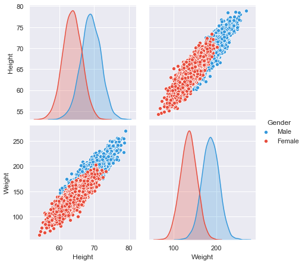
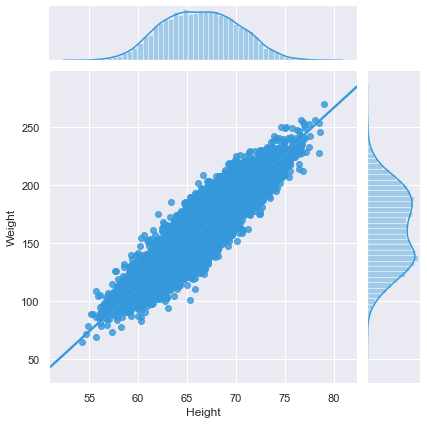
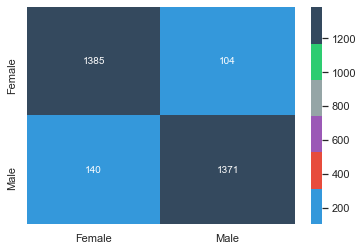

# Exercício Aula 19

Carregamento do dataset:

          Gender     Height      Weight
    0       Male  73.847017  241.893563
    1       Male  68.781904  162.310473
    2       Male  74.110105  212.740856
    3       Male  71.730978  220.042470
    4       Male  69.881796  206.349801
    ...      ...        ...         ...
    9995  Female  66.172652  136.777454
    9996  Female  67.067155  170.867906
    9997  Female  63.867992  128.475319
    9998  Female  69.034243  163.852461
    9999  Female  61.944246  113.649103
    
    [10000 rows x 3 columns]

## EDA

Correlação entre os atributos...

              Height    Weight
    Height  1.000000  0.924756
    Weight  0.924756  1.000000

Distribuição dos parâmetros.

Vamos codificar o gênero como 0 ou 1 e realizar um split dos dados, para treino e teste.

    Amostra para treinamento: 7000
    Amostra para testes     : 3000
    Converter valores ['Female' 'Male'] para [0 1]: 

## Logistic Regression

    Usados os valores padrão do scikit-learn exceto:
    LogisticRegression(max_iter=500, n_jobs=-1, random_state=0)

                  precision    recall  f1-score   support
    
          Female       0.91      0.93      0.92      1489
            Male       0.93      0.91      0.92      1511
    
        accuracy                           0.92      3000
       macro avg       0.92      0.92      0.92      3000
    weighted avg       0.92      0.92      0.92      3000
    

## Support Vector Machine

    Usados os valores padrão do scikit-learn exceto:
    SVC(C=5, random_state=0)

                  precision    recall  f1-score   support
    
          Female       0.91      0.93      0.92      1489
            Male       0.93      0.91      0.92      1511
    
        accuracy                           0.92      3000
       macro avg       0.92      0.92      0.92      3000
    weighted avg       0.92      0.92      0.92      3000
    

